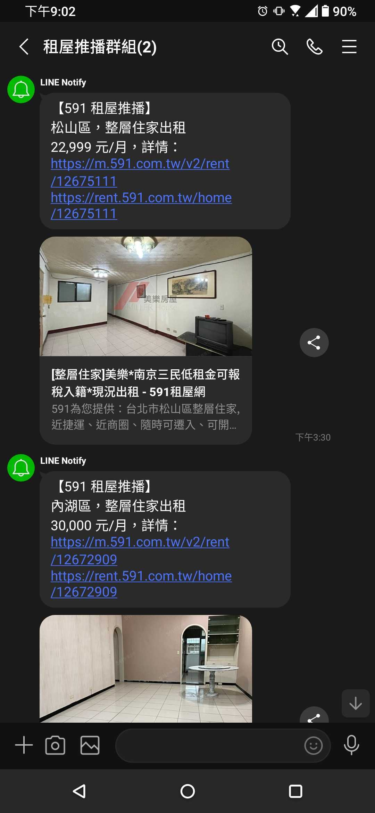

# Rent House - Line Notify

利用 Line Notify 即時推播 591 租屋網的最新上架物件

## Configuration

Step 1.

修改 `constants.js` 裡各項設定

- CRON_SYNTEX

  決定多久去 591 租屋網要資料，設定格式請參考：https://crontab.cronhub.io/

- RENT_LIST_QUERY, RENT_LIST_QUERY_1 (第二組條件)

  591 列表搜尋的條件

  ex. https://rent.591.com.tw/?kind=1&showMore=1&order=posttime&orderType=desc&section=3,4,10&searchtype=1&rentprice=20000,30000&area=18,

- RENT_INFO_QUERY

  額外過濾的條件 (需要自行在程式裡處理邏輯 `schedules/notify -> sendNotifyWithRentHouse`)

  - excludeMRTs: 排除捷運站

Step 2.

前往 [Line Notify 官網](https://notify-bot.line.me/my/services/) 申請 Line Notify Token (此時需綁定 `Token` 套用的群組，此群組為之後 Line Notify 推播到的地方)

Step 3.

`.env` 環境變數檔案設定

將 `.example.env` 重新命名為 `.env` 後將 Step 2. 拿到的 `LINE_NOTIFY_TOKEN` 填入

## Start server

```shell
git clone https://github.com/bcjohnblue/rent-house-line-notify
npm install
npm start
```



## Deploy (optional)

基本上執行 `npm start` 後即可在本機進行推播，但如果你想要將程式部署到雲端的話可以設定 `.env` 中的 `APP_URL` 指向你部署的網址，如此將固定過一段時間 ping 你部署的網站，以防止一些雲服務平台在閒置超過一定時間後會自動關閉 app 導致推播失效 (例如：[heroku 免費方案會在網站閒置 30 分鐘後自動關閉 app](https://dev.to/unorthodev/prevent-your-app-from-idling-on-heroku-2lmc))

設定 ping 的檔案位置：`schedules/ping.js` -> `pingSchedule`

預設執行時間：`'*/29 9-23 * * *'`，在 9:00 - 23:59 時段內，每 29 分鐘會 ping 一次 `APP_URL`

<br />

最後更新日期：2022/07/17
