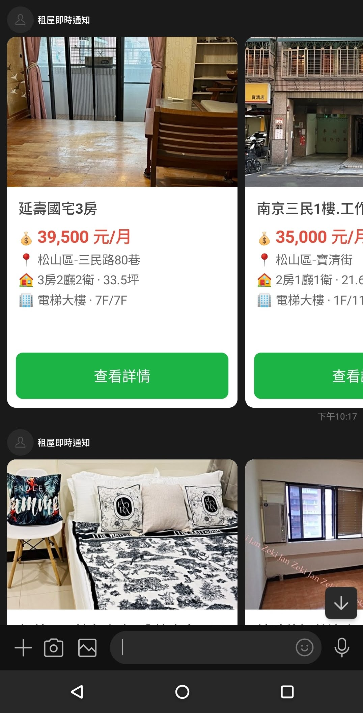

# Rent House - LINE Notify

利用 **LINE Messaging API** 的 Flex Message Carousel，搭配 **GCP Cloud Run Functions + Cloud Scheduler**，定時爬取 591 租屋網最新上架物件並推播通知。

## 推播效果

每張卡片包含：封面圖片、標題、💰 價格、📍 地址、🏠 格局＋坪數、🏢 建築類型＋樓層，以及「查看詳情」連結按鈕。



---

## 架構

```
Cloud Scheduler（每 3 小時）
  → Cloud Run Function (notifyRentHouse)
      → 爬取 591 租屋網（最多 3 頁 / 90 筆）
      → GCS（讀寫 cache.json，增量推播）
      → LINE Messaging API（Flex Message Carousel）
```

---

## 設定說明

### Step 1. 搜尋條件

修改 `constants.js`：

- **`RENT_LIST_QUERY`**：591 列表搜尋條件（區域、類型、租金範圍、坪數等）
  - 對應 591 網址參數：`https://rent.591.com.tw/?kind=1&section=4&rentprice=20000,40000&area=20,`
- **`RENT_INFO_QUERY.excludeMRTs`**：程式端額外排除的捷運站名稱
- **`CRON_SYNTEX`**：從環境變數 `CRON_SCHEDULE` 讀取，預設每天 09/12/15/18/21 點

### Step 2. LINE Messaging API 設定

1. 前往 [LINE Developers Console](https://developers.line.biz/) 建立 Messaging API Channel
2. 在 **Messaging API** 分頁產生 **Channel Access Token**（長效型）
3. 將官方帳號加為好友

### Step 3. 環境變數設定

將 `.example.env` 複製為 `.env` 並填入：

```env
# 本機開發用
PORT=5001
APP_URL=<YOUR_CLOUDFLARE_TUNNEL_URL>

# LINE Messaging API
LINE_CHANNEL_ACCESS_TOKEN=<YOUR_CHANNEL_ACCESS_TOKEN>
LINE_TARGET_ID=<YOUR_TARGET_ID>

# GCS Cache（本機開發不填，自動使用 No-Cache 模式）
GCS_BUCKET_NAME=<YOUR_BUCKET_NAME>

# Cloud Scheduler 排程（預設：每天 09/12/15/18/21 點台北時間）
CRON_SCHEDULE=0 9,12,15,18,21 * * *
```

### 取得 LINE_TARGET_ID

**推播給個人：**
LINE Developers Console → Channel → **Basic Settings** 最下方，取得 **Your user ID**（格式：`U...`）

**推播給群組：**
1. 在 LINE Developers Console 設定 Webhook URL（本機用 `cloudflared` tunnel，GCP 用 `lineWebhook` Function URL），路徑加 `/webhook`
2. 開啟 **Use webhook**
3. 將官方帳號邀請進群組，在群組傳一則訊息
4. 查看 log，會印出：
   ```
   ========================================
   📌 Group ID: C1234567890abcdef...
   將此 ID 填入環境變數的 LINE_TARGET_ID
   ========================================
   ```
5. 填入 `LINE_TARGET_ID`

---

## 本機開發

```bash
git clone https://github.com/bcjohnblue/rent-house-line-notify
npm install
node index.js
```

本機模式不需要 `GCS_BUCKET_NAME`，自動使用 **No-Cache 模式**（每次執行推播當前所有物件）。

使用 [cloudflared](https://developers.cloudflare.com/cloudflare-one/connections/connect-networks/downloads/) 建立 tunnel 讓 LINE Webhook 能連到本機：

```bash
cloudflared tunnel --url http://localhost:5001
```

---

## 部署到 GCP

### 前置需求

1. 在 [GCP Console](https://console.cloud.google.com) 建立專案並連結帳單帳號
2. 安裝 [gcloud CLI](https://cloud.google.com/sdk/docs/install) 並登入：
   ```bash
   gcloud auth login
   ```

### 一鍵部署

```bash
bash scripts/deploy.sh
```

會自動完成：
| 步驟 | 說明 |
|------|------|
| 啟用 API | Cloud Functions / Scheduler / Storage / Cloud Run / Cloud Build |
| 建立 GCS Bucket | 儲存 `cache.json`（增量推播用） |
| 部署 `notifyRentHouse` | Cloud Scheduler 呼叫的主函式（不公開） |
| 部署 `lineWebhook` | LINE Webhook 端點（公開） |
| 建立 Scheduler Job | 每天 09/12/15/18/21 點觸發（可透過 `CRON_SCHEDULE` 調整） |

部署完成後，將 `lineWebhook` URL 填入 LINE Developers Console 的 Webhook URL。

### 手動觸發測試

```bash
gcloud scheduler jobs run rent-house-notify --location=us-central1
```

### 查看 log

```bash
gcloud functions logs read notifyRentHouse --region=us-central1 --gen2 --limit=50
```

### 重置 Cache（重新推播所有物件）

```bash
gcloud storage rm gs://rent-house-notify-cache/cache.json
```

### 刪除整個 GCP 專案（停止所有服務）

```bash
gcloud projects delete rent-house-notify
```

> **注意**：刪除後 30 天內可還原，30 天後永久消失。會一次移除 Functions、Scheduler、GCS Bucket 等所有資源。

---


## LINE 免費額度說明

| 項目 | 說明 |
|------|------|
| 訊息額度 | 免費方案每月 200 則 |
| Carousel 計費 | 最多 12 個物件合併為 **1 則訊息** |
| 群組計費 | 推播次數 × 群組人數 |
| 預估用量 | 每 3 小時 1 次，2 人群組每月約 90–150 則 |

## GCP 免費額度說明

| 服務 | 免費額度 | 本專案用量 |
|------|---------|-----------|
| Cloud Run Functions | 200 萬次/月 | ~150 次/月 |
| Cloud Scheduler | 前 3 個 Job | 1 個 Job |
| Cloud Storage | 5GB + 5 萬次操作 | <1KB + ~300 次 |

---

最後更新日期：2026/04/26
